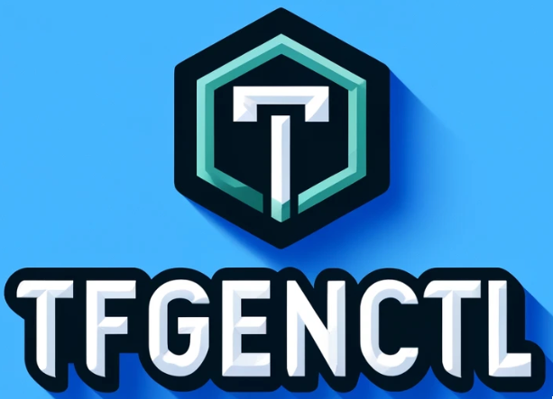

<h1 align="center">
  <br/>
</h1>
<p align="center">Conventional commits generated through <b>AI</b> for lazy engineers <b> and not so Lazy as well</b>.<br/><br/>

---
[](https://github.com/Excoriate/Komit/actions/workflows/go-build.yml)
[](https://github.com/Excoriate/Komit/actions/workflows/go-ci-lint.yaml)
[](https://github.com/Excoriate/Komit/actions/workflows/go-ci-tests.yml)

---
**TfGenCTL** is a CLI tool that allows you to generate Terraform code for different use cases. it's meant to facilitate the creation of common patterns, such as modules, examples and more.

---

## Installation 🛠️

### brew

```bash
brew install excoriate/tap/tfgenctl
```

---

## Getting Started 🚀

---


## Roadmap 🗓️

- [ ] Add more tests.
- [ ] Add support for Terratest tests generation.

---

## Contributing

Please read our [contributing guide](./CONTRIBUTING.md).

## Community

Feel free to contact me through:

- 📧 [Email](mailto:alex@makemyinfra.cloud)
- 🧳 [Linkedin](https://www.linkedin.com/in/alextorresruiz/)


<a href="https://github.com/Excoriate/komit/graphs/contributors">
  
</a>
